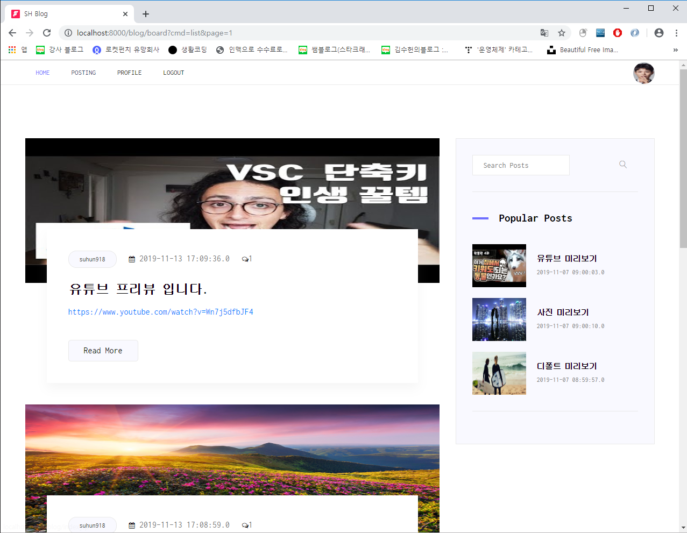

# Jsp-Model2-MySQL-blog
#### 나만의 블로그 만들기 JSP+Model2+MySQL

- git주소 : <https://github.com/suhun918/jsp-blog-mysql>



#### 1. 사용자 생성 및 권한 주기 및 DB 생성
- create user 'cos'@'localhost' identified by 'bitc5600';
- GRANT ALL PRIVILEGES ON *.* TO cos@localhost;
- create database cos;
- use cos;

#### 2. 테이블
```sql
CREATE TABLE user(
   id int auto_increment primary key,
    username varchar(100) not null unique,
    password varchar(100) not null,
    email varchar(100) not null,
    address varchar(100) not null,
    userProfile varchar(300) default '/blog/img/userProfile.png',
    createDate timestamp
) engine=InnoDB default charset=utf8;
```

```sql
CREATE TABLE board(
   id int auto_increment primary key,
    userId int,
    title varchar(100) not null,
    content longtext,
    readCount int default 0,
    createDate timestamp,
    foreign key (userId) references user (id)
) engine=InnoDB default charset=utf8;
```

```sql
CREATE TABLE comment(
   id int auto_increment primary key,
    userId int,
    boardId int,
    content varchar(300) not null,
    createDate timestamp,
    foreign key (userId) references user (id) on delete set null,
    foreign key (boardId) references board (id) on delete cascade
) engine=InnoDB default charset=utf8;
```

```sql
CREATE TABLE reply(
   id int auto_increment primary key,
    commentId int,
    userId int,
    content varchar(300) not null,
    createDate timestamp,
    foreign key (commentId) references comment (id) on delete cascade,
    foreign key (userId) references user (id) on delete set null
) engine=InnoDB default charset=utf8;
```

#### 3. Factory 세팅하기
<https://blog.naver.com/suhun918/221683068227>

#### 4. 부트스트랩 커스터마이징 HTML파일
WebContent/ui_sample/**

#### 5. 실행 영상
-youtube주소 : <https://www.youtube.com/watch?v=R0NvMR7JltE>
